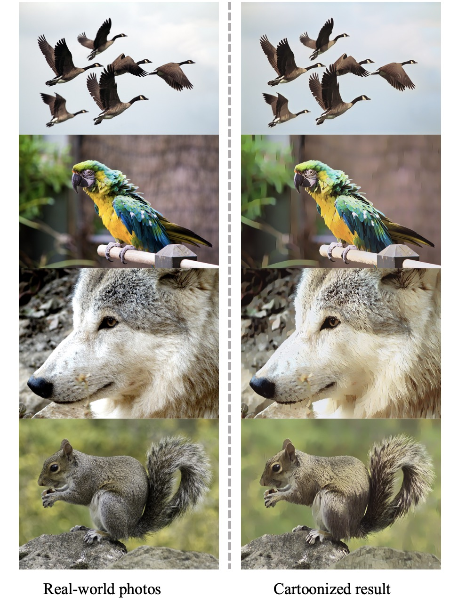

# Unsupervised Coherent Video Cartoonization with Perceptual Motion Consistency
Unsupervised Coherent Video Cartoonization with Perceptual Motion Consistency. AAAI 2022. [Arxiv](https://arxiv.org/abs/2204.00795)


## Setup Environment
```bash
conda env create -f environment.yaml
conda activate video-animation
```

## Training
1. Preparing Training Data
Download datasets from [this drive](https://drive.google.com/file/d/10SGv_kbYhVLIC2hLlz2GBkHGAo0nec-3/view) and unzip to datasets folder.
2. Download pretrained vgg from [here](https://drive.google.com/file/d/1j0jDENjdwxCDb36meP6-u5xDBzmKBOjJ/view?usp=sharing) and unzip, put it to `models/vgg19.npy`
3. Start training.
```
CUDA_VISIBLE_DEVICES=0 python train.py --exp_name with-pmc --temporal_weight 1.0
```

## Testing
Download Pretrained Network from [google drive](https://drive.google.com/file/d/1nlqoQdlWIHz5aAHVQ-1TfKy3pnZ3Dthl).

### Translating Images
- Translate images in input directory and save into output directory.
```bash
python inference.py --input_path ${your_input_folder} --output_path ${your_output_folder} --model_path pretrained.ckpt
```

### Translating Video
```bash
python translate_video.py --input_video ${your_input_video} --output_dir ${your_output_folder} --model_path pretrained.ckpt
```

## Results

### Image Results
| Images|
| ------- |
|  |
|  |
|  |
|  |

### Video Results
[](https://www.youtube.com/watch?v=Fbiopc40z58 "Video Animation")

### Visualization of Spatio-Temporal Coorelative Maps


## Citation
```
@inproceedings{Liu2022UnsupervisedCV,
  title={Unsupervised Coherent Video Cartoonization with Perceptual Motion Consistency},
  author={Zhenhuan Liu and Liang Li and Huajie Jiang and Xin Jin and Dandan Tu and Shuhui Wang and Zhengjun Zha},
  booktitle={AAAI},
  year={2022}
}
```

## Acknowledgment
- [WhiteBoxGAN](https://github.com/SystemErrorWang/White-box-Cartoonization) by @SystemErrorWang
- [Pytorch Lightening](https://www.pytorchlightning.ai/index.html)